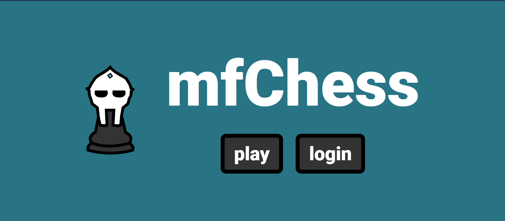
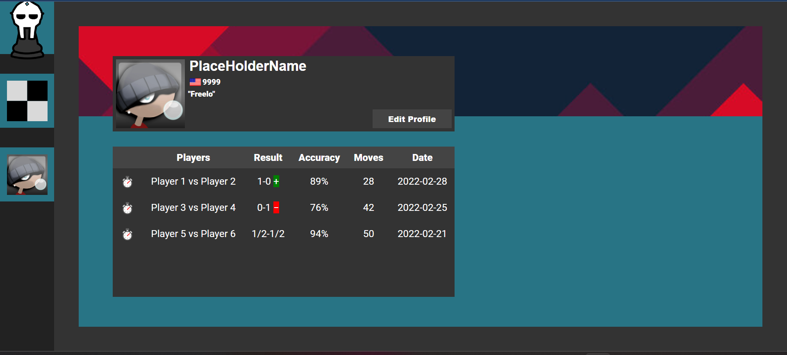
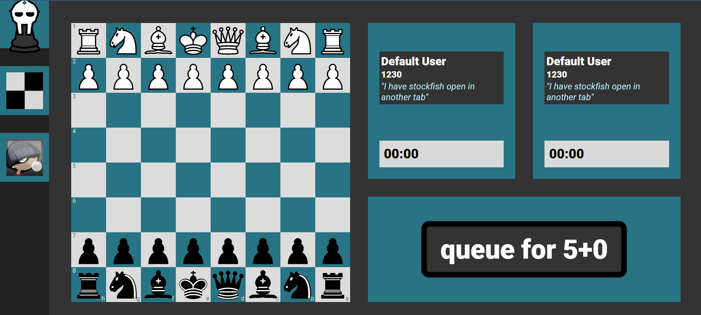

# mfChess Web Frontend
[]()
[]()
[]()
[]()

## ♟️ What is the mfChess?

<p align="center">
  
  
</p>
<p align="center">
  
</p>

Introducing mfChess, a cutting-edge React application designed to revolutionize the world of online chess. Built with Typescript, HTML, and CSS on the frontend, mfChess offers a seamless and immersive chess experience for players of all levels.

The repo serves as the frontend interface of mfChess, which presents a user-friendly page where chess enthusiasts can indulge in thrilling gameplay or effortlessly sign in using their Google account. By integrating with Google authentication, mfChess ensures convenient access while securely storing all user profile information.

One of the standout features of mfChess is its elo-based worldwide chess matchmaking system, allowing players to compete against opponents of similar skill levels. Engage in the classic standard rating chess game type and discover exciting challenges that push your strategic prowess to new heights.

Furthermore, mfChess incorporates a remarkable in-game analysis feature powered by Stockfish. Players can delve into the intricacies of their moves as well as their opponent's, enhancing their understanding of the game and sharpening their skills.

To personalize the experience, mfChess offers customizable user profiles where players can set their preferred profile picture, display name, and description. Additionally, these profiles act as a comprehensive repository, storing past games and providing a captivating narrative of one's chess journey.

mfChess is currently live at mfchess.com, offering a seamless and captivating online chess experience. The backend repository, which handles server-client handling and web socketing for the React app, can be found at the <a href="https://github.com/RiRah123/mfChess-Server">`mfChess-Server`</a> repo. Developers can explore the backend codebase and contribute to the project's growth.

# Running mfChess Frontend Locally

Using the terminal:

1. Clone the GitHub Project
   ```
   $ git clone https://github.com/RiRah123/mfChess-Web-Client.git
   ```
2. Navigate to the cloned project
   ```
   $ cd mfChess-Web-Client
   ```
3. Install package using yarn
   ```
   $ yarn install
   ```
   `Note:` If you do not already have yarn install, please check out the <a href="https://classic.yarnpkg.com/lang/en/docs/install/#windows-stable">yarn documentation website</a> for details on how to.

## ➕ What is Next for mfChess Frontend?

In the future, the frontend of mfChess plans to expand its repertoire of features. Exciting additions on the horizon include introducing game modes like bullet, blitz, and rapid modes to cater to different time preferences. Puzzles, inspired by platforms like Chess.com, will challenge players with mind-bending scenarios. Moreover, mfChess envisions a unique Chessboxing training mode, combining chess puzzles and boxing training, offering a thrilling and unconventional workout experience.

With its sleek design, extensive feature set, and commitment to constant improvement, the mfChess frontend is set to captivate chess enthusiasts, creating a vibrant community of players eager to master the game and enjoy a truly exceptional online chess experience.
